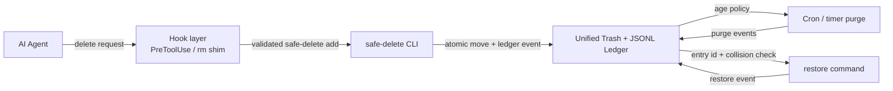

# CONTRACT FREEZE PROPOSAL — Phase 1: Safe-delete architecture contract

**Status:** Contract Freeze proposal only; revised after Kimi Code `REQUEST_CHANGES`,
pending review and `FREEZE ACK` by `@Dylan5237` on
[Issue #3](https://github.com/Dylan5237/safe-delete-cli/issues/3).

**Contract ID:** `safe-delete/p1` · proposed version `1`

**Review artifact:** [docs PR #10](https://github.com/Dylan5237/safe-delete-cli/pull/10)

This document is a reviewable mirror of the Contract Freeze proposal posted on
Issue #3. It defines behavior and interfaces for the later implementation and
evidence phases. It does not authorize product implementation before the
disposer records `FREEZE ACK`.

## Goal and boundaries

### Product goal

Provide one safe-delete protocol for AI-agent workspaces:

1. Agent deletion requests go through `safe-delete`, not raw `rm`.
2. Successful deletions move entries into one unified trash root.
3. Every move has an append-only ledger record with enough identity and context
   to list, restore, audit, and later purge it.
4. Restore returns an entry to its original path, subject to explicit collision
   safety.
5. A timed purge removes only eligible, already-trashed entries under an
   explicit retention policy.
6. A hook layer covers supported `PreToolUse` and `rm`-shim boundaries. It is a
   client-side control, not a kernel guarantee.

### Phase 1 goal

Freeze one behavior-focused contract so P2–P6 can implement and verify against
named boundaries without making architecture guesses. The contract fixes the
CLI vocabulary, storage identity, ledger compatibility rules, restore and purge
safety, hook failure behavior, and acceptance gates.

### In scope

- The CLI command surface and machine-readable output expectations.
- One unified trash root shared by projects for a user, with an explicit
  same-filesystem operational boundary.
- An append-only UTF-8 JSONL ledger with versioned lifecycle events.
- P2 minimum fields and P3 rich metadata fields.
- Collision, path, atomicity, restore, and failure semantics.
- The adapter-neutral hook contract for supported agent/tool boundaries.
- Default purge retention, its configuration source, dry-run behavior, cron/timer
  invocation, and audit semantics.
- The initial machine-readable error-code vocabulary and the complete lifecycle
  state machine, including crash recovery and orphan-payload audit behavior.
- Replayable acceptance gates for P2, P3, P4, P5, and P6.

### Out of scope for this proposal

- Product CLI, hook packages, scheduler, or test-harness implementation.
- A graphical interface, web service, remote trash, or multi-user server.
- Copying across filesystems as a substitute for an atomic move.
- Automatic ledger compaction, cloud backup, encryption, or legal retention.
- Vendoring or depending on `skills-desktop` `trashService`; the design remains
  a thin CLI, ledger, and hook layer.
- Changes to the pinned `agent-project-ops` methodology.

### Deferred to later phases

- **P2:** CLI surface/bootstrap (`init`, `list`, `show`, `version`, shared
  `--json`/exit behavior), atomic trash move, minimum ledger writer, orphan
  audit reporting, and restore.
- **P3:** rich project/session/reason/agent/tool metadata and compatibility
  tests.
- **P4:** concrete PreToolUse adapters, `rm` shim, installation, and hook
  enforcement tests.
- **P5:** retention evaluator, periodic purge runner, and purge failure/retry
  tests.
- **P6:** clean-checkout full-path replay and evidence-to-acceptance matrix.

## Architecture



The CLI is the single supported deletion path. A hook may route a recognized
raw deletion request to `safe-delete add`, or deny it when routing is not safe.
Direct CLI calls are valid when the hook is not the caller. The hook never
reports success until the CLI reports success.

The default deployment is local and per-user:

```text
AI agent → configured hook boundary → safe-delete CLI
                                      ├─ move into unified trash
                                      └─ append/read JSONL ledger
                                                     ├─ restore
                                                     └─ cron/timer purge
```

## CLI contract

The executable is `safe-delete`. All commands accept the global options
`--root DIR` (or `SAFE_DELETE_ROOT`) and `--json` where output is meaningful.
Paths are passed after `--` when an option-like path must be unambiguous. P2
freezes the shared machine-readable surface: `--json` writes one UTF-8 JSON
object per invocation with `command`, `ok`, `results`, and `errors` top-level
keys; batch commands put one result per input in `results`, and every error
object has a frozen `code` from the vocabulary below. P2 owns the exact
command-specific result fields without changing those envelope invariants.

| Command | Contract and important flags |
| --- | --- |
| `safe-delete init` | Create the root, `trash/objects`, `locks`, and ledger if absent. `--root DIR`, `--json`. Never removes existing data. |
| `safe-delete add PATH...` | Move each existing regular file, directory, or symlink into trash and append one `trash` event per successful path. `--reason TEXT`, `--project DIR`, `--session-id ID`, `--agent ID`, `--tool ID`, `--extensions JSON_OBJECT`, `--dry-run`, `--root DIR`, `--json`. P3 metadata flags apply to every input in the invocation. |
| `safe-delete list` | List active entries by default. `--all` includes active, recoverable `purge_pending`, restored, purged, and audit-error records; `--orphans` reports only payload objects with no matching valid `trash` event; `--project DIR` and `--original PATH` are exact normalized-path filters; `--json`, `--root DIR`. The normal list also reports orphan and ledger audit errors. |
| `safe-delete show ENTRY_ID` | Show the immutable creation record and lifecycle events for an entry. `--json`, `--root DIR`. |
| `safe-delete restore ENTRY_ID` | Move an active payload to its original path. `--to PATH` is an explicit alternate destination; `--create-parents` opts into creating missing parents; `--json`, `--root DIR`. Existing destinations are never overwritten. |
| `safe-delete purge` | Preview eligible entries by default. `--dry-run` is explicit preview; physical deletion requires both `--execute` and `--yes`. Optional mutually exclusive `--older-than DURATION` or `--before RFC3339` overrides the retention default for that invocation; `--json`, `--root DIR`. |
| `safe-delete hook install AGENT` | Reserved for P4 adapter packages. Installation is not part of the P1 or P2 implementation. |
| `safe-delete version` | Print the CLI and contract versions without touching trash or ledger state. |

### CLI behavior and errors

- `add` is a move operation, not a copy followed by an untracked delete. It
  refuses special files (devices, sockets, and FIFOs) and final-target
  symlink traversal; it moves a symlink itself.
- Each input to `add` is independently transactional. A batch may have partial
  success; `--json` reports one result per input and the process exits nonzero
  if any input fails.
- Successful commands emit stable JSON objects when `--json` is supplied and
  diagnostics to stderr. The CLI does not print a success response for a
  physically moved item until its ledger event is durable.
- A command reserved for a later phase exits with usage category `2` and
  `unsupported_command`; it does not mutate the filesystem or ledger. Thus
  `purge` is unavailable until P5 and `hook install` until P4, while the P2
  surface is owned by the P2-S0 slice below.
- The reserved exit categories are: `0` success, `2` usage/unsupported input,
  `3` destination or identity conflict, `4` storage/ledger failure, and `5`
  partial batch failure. Exact numeric mapping is implementation detail only
  if the named category and machine-readable error code remain stable.
- A source that does not exist, a root path, a path inside the trash root, an
  unsafe ancestor/descendant relationship with the trash root, a non-UTF-8
  path, or a cross-device move is rejected with the source left unchanged.
- `--dry-run` and `--execute` are mutually exclusive. `--execute` without
  `--yes` is a usage/confirmation error; the CLI never guesses the operator's
  intent.
- No command has an implicit `--overwrite`, and no hook may add one.

### Frozen machine-readable error vocabulary

The following lowercase `snake_case` strings are the initial stable vocabulary
from P2 onward. They are the values of JSON error `code`; hook `reason_code`
uses these CLI values where applicable and has the small hook-only vocabulary
listed after the table. Implementations may add human-readable messages, but
may not rename, silently repurpose, or replace these codes in contract version
`1`. Lifecycle event `error_code` values, including the required
`purge_failed` classification, use the same CLI vocabulary.

| Code | Meaning and primary use | Reserved exit category |
| --- | --- | --- |
| `usage_error` | Invalid argument, ID, duration, timestamp, or conflicting flags. | `2` |
| `unsupported_command` | A recognized command reserved for a later phase. | `2` |
| `source_not_found` | An `add` source does not exist. | `2` |
| `unsupported_kind` | A special file or otherwise unsupported source kind. | `2` |
| `unsupported_path_encoding` | A path cannot be represented as UTF-8 JSONL. | `2` |
| `path_forbidden` | Root, ledger, lock, trash, or unsafe root relationship was targeted. | `2` |
| `cross_device` | Source/trash or restore-destination/trash devices differ, or rename returned `EXDEV`. | `2` |
| `destination_exists` | Restore destination exists according to `lstat`, including a dangling symlink. | `3` |
| `destination_parent_missing` | Restore parents are missing and `--create-parents` was not supplied. | `3` |
| `entry_not_found` | No ledger entry exists for the requested ID. | `3` |
| `entry_not_restorable` | The entry is not in `active` state, including unresolved `purge_pending`. | `3` |
| `already_restored` | Idempotent repeat of a completed restore; no mutation occurs. | `0` |
| `already_purged` | A queried entry is already terminal `purged`; no mutation occurs. | `0` |
| `entry_id_collision` | Exclusive object creation found an existing entry identity. | `3` |
| `unsupported_schema_version` | A record uses a schema major this implementation cannot read. | `4` |
| `malformed_ledger` | A JSONL line or required field is malformed. | `4` |
| `duplicate_event_id` | An `event_id` occurs more than once in the ledger. | `4` |
| `impossible_transition` | Events cannot form the frozen lifecycle state machine. | `4` |
| `payload_missing` | A valid ledger entry requires a payload that is absent. | `4` |
| `orphan_payload` | A trash object payload has no matching valid `trash` event. | `4` |
| `ledger_failure` | Ledger open, lock, append, flush, or durability operation failed. | `4` |
| `storage_failure` | A filesystem operation failed without a more specific code. | `4` |
| `rollback_failed` | A failed transactional operation could not return the payload to its prior path. | `4` |
| `purge_remove_failed` | A valid purge candidate could not be physically removed; its payload remains. | `5` |
| `partial_failure` | A batch or purge completed some independent work but not all of it. | `5` |

Audit codes are not inferred away: read-only commands report the specific code,
and destructive commands use the same code while failing closed as defined in
the ledger audit section.

Hook-only `reason_code` values are also stable: `raw_delete` means a recognized
request is being routed, `unsupported_delete_invocation` means a deletion
request is denied because it cannot be proven safe, `cli_unavailable` means the
safe-delete executable cannot be run, `storage_unavailable` means its root or
ledger cannot be used, and `safe_delete_error` means the CLI returned an error
without a more specific propagated code. A hook propagates a specific CLI code
such as `cross_device` when one is available; these values do not add new
filesystem behavior.

## Storage layout and identity

The default root is:

```text
${SAFE_DELETE_ROOT:-${XDG_DATA_HOME:-$HOME/.local/share}/safe-delete}
```

An explicit `--root` takes precedence over the environment. The root is one
unified namespace for the current user; it is not a `.trash` directory per
project.

### Same-filesystem operational boundary

The unified root intentionally serves one filesystem: every supported source
path and `<root>/trash/objects` must be on the same filesystem so the move can
be an atomic rename. A source on another device or mount is rejected by design
with `cross_device`; the source remains unchanged. A hook that encounters such
a source returns `deny` (and an `rm` shim exits failed) after the underlying
`safe-delete add` result; it never falls back to raw deletion or copying.
Operators must place the root on the workspace volume, or otherwise configure
the root on the same volume as the workspaces it is meant to serve. A single
root is not a multi-volume trash service; this operational limitation is part
of the contract for disposer acceptance.

```text
<root>/
├── ledger.jsonl
├── locks/
│   └── ledger.lock
└── trash/
    └── objects/
        └── <entry_id>/
            └── payload
```

The root and its private subdirectories are created with user-only permissions
where the host supports them. `trashed_path` is the absolute path to
`<root>/trash/objects/<entry_id>/payload`.

### Identity and collision policy

- Every trash operation receives a cryptographically random RFC 9562 UUID
  version 4. `entry_id` and `event_id` use the same canonical form: 36-character
  lowercase hexadecimal UUID text with hyphens, with no `ent-` or `evt-` prefix.
  `entry_id` is unique within the root's object/ledger namespace and
  `event_id` is unique across the ledger; both are identity values, not the
  original basename or project.
- The object directory is created with exclusive creation. An ID collision is
  retried; an existing object is never overwritten or reused.
- Multiple historical entries may have the same `original_path`. `list` must
  expose each distinct `entry_id`.
- Restore defaults to the recorded `original_path`. If that destination exists
  according to `lstat` (including a dangling final symlink), restore fails with
  a collision and leaves the payload and ledger unchanged. Existing parent
  symlinks are resolved consistently before the operation; the final
  destination symlink is never followed. The operator may choose a non-existing
  `--to PATH`; the effective destination is recorded in the restore event.
  Automatic renaming and overwrite are not part of this contract. Where the
  platform supports it, restore uses an atomic no-replace rename; otherwise the
  implementation must document and test the residual check/rename race and
  still must not intentionally overwrite.
- Paths are stored as absolute, normalized paths. The final symlink is not
  dereferenced for `add`; existing parent symlinks are resolved consistently by
  the implementation before the move. The trash root, its ledger, and its lock
  files are never valid deletion targets. Paths containing bytes that are not
  valid UTF-8 are rejected with `unsupported_path_encoding` before a move.
- The default move must be an atomic same-filesystem rename. On `EXDEV` or any
  unavailable atomic primitive, the CLI fails closed and leaves the source in
  place; P1 does not authorize a copy/delete fallback.
- The ledger is serialized with an OS `flock` on `locks/ledger.lock`; the lock is
  automatically released when the process exits, so no stale-lock cleanup is
  required. An append is newline-delimited, UTF-8, and flushed durably before
  the CLI reports success. If a ledger append fails after a move, the CLI
  attempts to roll the payload back. If rollback also fails, it returns
  `rollback_failed`/`orphan_payload` and prints both paths for the documented
  manual recovery route below; it never falls back to raw deletion.

### Orphan payload audit and recovery

An orphan payload is a payload under `<root>/trash/objects/<entry_id>/payload`
whose directory ID has no matching valid `trash` event in the ledger. The
failure window is intentional and bounded: `add` performs best-effort rollback
when its ledger append fails, but a failed rollback must not make the remaining
payload invisible.

`list` always reconciles the object directories with valid creation events.
It reports an orphan as an `orphan_payload` audit error with its `entry_id` and
`trashed_path`; `list --orphans` restricts the report to these reconciliation
results. An orphan is not a normal ledger entry and is never eligible for
`restore` or `purge`. The report is produced even when other valid entries can
still be listed.

The documented recovery steps are: (1) preserve the orphan payload and save
the failed `add` diagnostic, including its printed source and trash paths; (2)
inspect the payload and verify the intended original path; (3) if that path is
known, absent, and on the same filesystem, an operator may move the payload
back with a no-overwrite operation, or may leave it quarantined for review if
the path is occupied or unknown; (4) remove only an empty, verified object
directory after the recovery is recorded in the operator's audit log. A
cross-device or uncertain recovery remains quarantined and is escalated; no
copy/delete fallback, guessed ledger event, overwrite, or raw deletion is
allowed. The orphan remains visible to `list` until its object is resolved.

## Ledger contract

`<root>/ledger.jsonl` is an append-only event log: one UTF-8 JSON object per
line, no pretty-printing, and no in-place edits. An `entry_id` identifies one
payload; an `event_id` identifies one ledger event. The logical current state is
computed by replaying valid events for an entry in file order.

### Versioning and compatibility

- `schema_version` is the integer ledger schema major, currently `1`.
- This document's `safe-delete/p1` contract version is `1`; contract version 1
  requires ledger `schema_version: 1` and hook `protocol_version: 1`. The three
  numbers are related but independently scoped: an incompatible ledger change
  increments `schema_version`, an incompatible hook wire change increments
  `protocol_version`, and a behavior/interface change increments the contract
  version as appropriate. A contract revision does not silently reinterpret an
  existing schema or protocol.
- Additive fields in schema `1` are allowed only as defined core fields or
  inside `extensions`; they do not change the version.
- A breaking change increments `schema_version`. A reader must not restore or
  purge an entry with an unsupported future version; read-only commands report
  the affected entry as `unsupported_schema_version`, while destructive
  commands fail closed under the audit rules below.
- P3 readers treat a missing P2 rich field as `null` and preserve unknown
  `extensions`. They must not rewrite old lines just to add fields.
- A malformed line, duplicate `event_id`, unsupported schema, missing required
  field, or impossible lifecycle transition is an audit error. The command
  blast radius is fixed in the table below; no command may infer state from a
  record it has classified as erroneous.

### Fields

| Field | P2 minimum | P3 rich contract | Meaning |
| --- | --- | --- | --- |
| `schema_version` | Required integer `1` | Required | Ledger schema major. |
| `event_id` | Required unique ID | Required | Unique event identity for replay/deduplication. |
| `entry_id` | Required unique ID | Required | Stable identity of the trashed payload. |
| `operation` | Required: `trash` or `restore` | Also `purge_intent`, `purge_complete`, `purge_failed` | Lifecycle event. `purge_failed` is an event, not a state name. |
| `state` | Required: `active` or `restored` | Also `purge_pending` or `purged` | Resulting logical state after the event. A `purge_failed` event always records `active`. |
| `original_path` | Required on every event | Required | Absolute normalized source/destination path recorded at `add`. |
| `trashed_path` | Required on every event | Required | Absolute payload path under the unified root. |
| `kind` | Required: `file`, `directory`, or `symlink` | Required | Entry kind; special files are rejected. |
| `timestamp` | Required | Required | Event time in UTC RFC 3339 format with `Z`; the initial `trash` time is the retention age anchor. |
| `restore_path` | Required on `restore`, otherwise absent | Same | Actual restore destination, equal to `original_path` unless `--to` was used. |
| `project` | Absent or `null` | Required key on every P3-written event; JSON `string` or `null` | Canonical project root when known; stored using the project-path rule below. |
| `session_id` | Absent or `null` | Required key on every P3-written event; JSON `string` or `null` | Supplied agent session/invocation identity; never generated by the CLI. |
| `reason` | Absent or `null` | Required key on every P3-written event; JSON `string` or `null` | Human/agent-provided deletion reason; never invented from a guess. |
| `agent` | Absent or `null` | Required key on every P3-written event; JSON `string` or `null` | Calling agent identity when known; never inferred from a username or host. |
| `tool` | Absent or `null` | Required key on every P3-written event; JSON `string` or `null` | Calling tool or hook adapter identity; a known direct CLI call uses the explicit `safe-delete-cli` value. |
| `extensions` | Optional object | Optional object; a missing value is `null` in a normalized read projection | Namespaced additive metadata; unknown keys and values are preserved without promotion or dropping. |
| `error_code` | Absent | Required on `purge_failed` | Stable failure classification; payload remains available. |

The P2 creation record is therefore at least:

```json
{"schema_version":1,"event_id":"0f8fad5b-d9cb-469f-a165-70867728950e","entry_id":"550e8400-e29b-41d4-a716-446655440000","operation":"trash","state":"active","original_path":"/workspace/app/file.txt","trashed_path":"/home/user/.local/share/safe-delete/trash/objects/550e8400-e29b-41d4-a716-446655440000/payload","kind":"file","timestamp":"2026-09-16T07:00:00Z"}
```

A P3 creation record adds the reserved rich keys, including explicit `null`
values when context is unavailable:

```json
{"schema_version":1,"event_id":"6ba7b810-9dad-41d1-80b4-00c04fd430c8","entry_id":"550e8400-e29b-41d4-a716-446655440000","operation":"trash","state":"active","original_path":"/workspace/app/file.txt","trashed_path":"/home/user/.local/share/safe-delete/trash/objects/550e8400-e29b-41d4-a716-446655440000/payload","kind":"file","timestamp":"2026-09-16T07:00:00Z","project":"/workspace/app","session_id":"sess-123","reason":"remove generated artifact","agent":"codex/luna","tool":"pretooluse:shell","extensions":{"vendor":{"trace_id":"trace-7"}}}
```

`restore` appends a completed restore event only after the move succeeds.
`purge` uses a durable `purge_intent` before physical removal and then appends
`purge_complete`. A failed physical removal appends `purge_failed` with
`state: "active"` while retaining the payload, so the entry is eligible for
restore or a later purge retry. If the process stops after `purge_intent` while
the payload is still present, the replayed `purge_pending` entry is also a
retry candidate. Replaying the ledger must leave a purged payload ineligible
for restore and a restored payload ineligible for purge.

### Audit-error blast radius

The following rules apply uniformly to malformed JSONL rows, duplicate
`event_id`, unsupported schema versions, missing required fields, impossible
lifecycle transitions, and ledger/object inconsistencies such as an orphan or
missing payload:

| Command | Contractual behavior on an audit error |
| --- | --- |
| `list` (including `--all` and `--orphans`) | Report the specific error, skip only the affected entry when it can be localized, continue listing unrelated valid entries, and exit nonzero if any audit error was found. A malformed line with no recoverable `entry_id` is reported as a ledger-level error. |
| `show` | Report the requested entry's audit error without guessing its state and exit nonzero; unrelated valid entries are not changed. |
| `add` | Preflight the existing ledger under the lock and fail closed before moving any input if an audit error exists. If the new append fails after a move, use the rollback/orphan rules above. |
| `restore` | Fail closed for the whole command before moving a payload if any audit error is found during ledger/object preflight; it never restores based on a partial replay. |
| `purge` | Perform the same full preflight and fail closed for the whole command, with no `purge_intent`, if any audit error is found. It does not skip a bad row and continue. |

After a valid preflight, ordinary per-entry filesystem or purge-removal
failures are not audit errors: `purge` appends `purge_failed` with
`purge_remove_failed`, retains that payload, continues other independent
entries, and returns `partial_failure`/exit category `5`. This distinction
resolves the apparent tension between fail-closed ledger replay and continued
processing of valid purge candidates.

### Lifecycle state machine and crash recovery

The only logical states are `active`, `purge_pending`, `restored`, and
`purged`. `restored` and `purged` are terminal. `purge_pending` is a
recoverable in-flight state, not a terminal failure state; `purge_failed`
always transitions back to `active`.

| Current state | Event or condition | Required action | Next state |
| --- | --- | --- | --- |
| none | `trash` after successful move and durable append | Create the unique object and record its initial retention timestamp. | `active` |
| `active` | `restore` | Under the ledger lock, validate payload and destination, perform the no-overwrite same-filesystem move, then append the completed event. | `restored` |
| `active` | eligible `purge_intent` | Under the ledger lock, durably append intent before removing any payload. | `purge_pending` |
| `purge_pending` | physical removal succeeds | Append `purge_complete` only after the payload is gone. | `purged` |
| `purge_pending` | physical removal fails and payload remains | Append `purge_failed` with a stable error code, retaining the payload. | `active` |
| `purge_pending` | process crash/interruption after `purge_intent`, payload still present | On the next `purge`, treat the last-event `purge_intent` entry as a recovery candidate and retry physical removal under the lock; success goes to `purge_complete`, failure goes through `purge_failed`. | `purge_pending` until resolved, then `purged` or `active` |
| `purge_pending` | payload absent before a valid `purge_complete` is recorded | Report `payload_missing`/an incomplete purge as an audit error; do not infer `purged`, restore, or retry it automatically. | `purge_pending` but blocked |
| `restored` or `purged` | any further lifecycle mutation | Reject as a terminal-state operation; retain the history. | unchanged |

An `active` entry whose last event is `purge_failed` is therefore both restore
eligible and purge eligible when old enough. A `purge_pending` entry is a purge
candidate only when its last event is `purge_intent` and its payload is still
present; this is the explicit crash-recovery exception to the normal `active`
candidate rule. `list --all` names these states exactly and never uses an
undefined "failed" state. A physical removal followed by a crash before
`purge_complete` is intentionally an audit error rather than an unsafe guess.

### P3 metadata source and missing-value policy

For each rich field, the source precedence is explicit CLI flag, hook-provided
context, supported environment context, then detected value where defined, and
finally an honest missing value. A present higher-precedence value is not
silently replaced by a lower-precedence value. An invalid supplied value is a
usage/audit error; an absent value is not an error.

| Field | Precedence, highest first | Missing result |
| --- | --- | --- |
| `project` | `--project` → hook `project` → `SAFE_DELETE_PROJECT` → nearest supported project root detected from the invocation directory | `null` |
| `session_id` | `--session-id` → hook `session_id` → `SAFE_DELETE_SESSION_ID` | `null`; no generated session ID |
| `reason` | `--reason` → hook `reason` | `null`; no reason inferred from argv or path |
| `agent` | `--agent` → hook `agent` → `SAFE_DELETE_AGENT` | `null`; no username, hostname, or process identity inference |
| `tool` | `--tool` → hook `tool` → known direct CLI caller `safe-delete-cli` | `null` when the caller cannot be identified |
| `extensions` | `--extensions` → hook `extensions` | `null` in a read projection; no environment or detection source |

The `project` value is path-shaped metadata, not a deletion target. It uses the
same normalization rule as `original_path`: absolute `normpath`, with parent
symlinks resolved and the final component not dereferenced. It must be valid
UTF-8 and must not contain NUL. A detected root is used only when the supported
detector returns a canonical root; a missing or inconclusive detector result is
`null`, not a guess from a basename.

The other scalar fields are opaque UTF-8 strings. P3 uses maximum encoded sizes
of 256 bytes for `session_id`, `agent`, and `tool`, and 4,096 bytes for
`project` and `reason`. Non-empty values are preserved exactly (no trimming,
case folding, or normalization); empty or whitespace-only values are coerced
to `null`. NUL, invalid UTF-8, and overlong values are rejected before any
source move or ledger append. The same validation applies to flag, hook, and
environment values; an invalid explicit value does not fall through to a
lower-precedence source.

`extensions`, when present, is a top-level JSON object no larger than 16 KiB
when compactly encoded as UTF-8. Its keys must be JSON strings and its values
must be finite JSON values; a non-object, duplicate-key input, NaN, Infinity,
NUL-bearing string, or overlarge object is rejected. The object is not
semantically normalized: producer namespaces, key spelling, and nested values
remain intact. Unknown extension keys are retained on every read/write path.
On-disk P3 events omit `extensions` when none is supplied; legacy omission is
shown as `null` by a normalized read projection without rewriting the line.

`timestamp` is generated by the CLI in UTC. Caller-supplied timestamps are not
accepted as the audit timestamp. Every new P3 lifecycle event copies the rich
metadata from the entry's creation event; restore and later lifecycle actions
do not re-resolve ambient environment and cannot mutate the deletion context.

### P3 field and CLI projection rules

P3 keeps the existing `--json` envelope (`command`, `ok`, `results`, and
`errors`). `add --json` returns the six rich keys for each successful result;
`list --json` includes them in each entry result; and `show --json` exposes them
in the creation record and lifecycle events. A P2 record that omits a scalar
rich key is represented as that key with `null` in memory/output. Its
`extensions` omission is represented as `null` in the normalized projection.
No projection is written back automatically.

The P3 CLI delta is limited to wiring the already-sketched `add` flags
`--project`, `--session-id`, `--reason`, `--agent`, and `--tool`, plus the
`--extensions JSON_OBJECT` flag. Each flag may occur once and applies to every
`PATH` in a batch; per-path metadata syntax is not part of P3. `list --project DIR`
remains the exact normalized-project filter. P3 adds no session, reason,
agent, tool, or extension filters. `show` and `restore` take no metadata
override; restore copies the recorded context into its new event.

P3 does not change the shared `--root`, `--json`, exit-category, or error-code
contract. Metadata validation happens before moving an input. A dry run
resolves and validates the same metadata but does not append a record. A
successful move is not reported until its event, including the resolved rich
fields, is durably appended.

P3 is implemented before concrete P4 adapters exist, so P3 acceptance tests
exercise the precedence chain through flags, supported environment variables,
and a small adapter-context fixture. The fixture stands in for hook context;
it does not authorize P4 installation or enforcement work and does not change
the frozen precedence.

### P3 Contract Freeze status (Issue #5)

**Status:** `freeze:pending` — this is a Phase 3 contract proposal only. No
`FREEZE ACK` is recorded in this document, and no P3 implementation branch is
authorized until the disposer decides on [Issue #5](https://github.com/Dylan5237/safe-delete-cli/issues/5).

This P3 refinement is subordinate to the already-frozen architecture: the
shared CLI and JSON envelope in [CLI contract](#cli-contract), path and
same-filesystem rules in [Storage layout and identity](#storage-layout-and-identity),
append-only/versioned records in [Ledger contract](#ledger-contract), and
no-overwrite restore in [Restore semantics](#restore-semantics) remain
unchanged. It makes the P3 rows in [Fields](#fields), the source chain above,
and the P3 row in [Later-phase acceptance gates](#later-phase-acceptance-gates)
replayable without changing P2 behavior.

Exception #12 remains a P2-only accepted carve-out: P3 does not expand restore
staging isolation claims, reopen same-UID staging mutation, or represent that
residual publication-identity risk as fixed.

## Restore semantics

`safe-delete restore ENTRY_ID` selects one active entry by stable ID, checks
that the payload exists and is a supported schema, checks the destination, and
moves the payload back. The default destination is `original_path`; `--to` is
an explicit alternative. It never overwrites, follows the deleted final
symlink, or silently restores a different entry. It holds the ledger `flock`
from state/destination validation through the move and durable restore-event
append, so it cannot interleave with purge. If the destination is on another
filesystem, restore fails closed with `cross_device`; it never copies.

Missing parent directories cause a safe failure by default. `--create-parents`
is the explicit opt-in and is covered by restore tests. Destination existence
uses `lstat`, so a dangling final symlink is a collision; parent symlinks are
resolved according to the normalized-path rule above. A restored entry stays
in the ledger for audit and is not eligible for a later purge. Repeating the
same restore returns an idempotent `already_restored` result without changing
the filesystem. If the restore append fails after the move, the CLI attempts a
same-filesystem rollback under the same lock; a failed rollback returns
`rollback_failed` with both paths and leaves the discrepancy for `list` audit
reporting rather than guessing a completed restore.

Phase 2's accepted threat-model carve-out for same-UID mutation of private
staging entries is recorded in [architecture exceptions](exceptions.md). Its
residual publication-identity risk is explicit and is not represented as fixed.

## Hook contract

P4 will provide host-specific packages, but every adapter must normalize to the
following adapter-neutral request/decision contract. This section freezes the
boundary behavior only; it does not implement an adapter, change the P2/P3 CLI,
or make a host configuration file part of the trash/ledger namespace.

### Adapter-neutral request and decision wire contract

The adapter receives one tokenized invocation at a time. A shell source string
is not a substitute for `argv`: a host that cannot provide the exact token
boundary must deny the deletion request. The request is UTF-8 JSON and has
these fields:

```json
{
  "protocol_version": 1,
  "request_id": "req-123",
  "tool": "shell",
  "argv": ["rm", "-rf", "build"],
  "cwd": "/workspace/app",
  "project": "/workspace/app",
  "session_id": "sess-123",
  "agent": "codex/luna",
  "reason": "remove generated build output",
  "extensions": {"example.org/trace": {"source": "ci"}}
}
```

`protocol_version`, `request_id`, `tool`, `argv`, and `cwd` are required. The
version must be exactly `1`; `request_id` is an opaque, non-empty per-request
correlation value and is echoed unchanged; `tool` identifies the host tool
shape (for example `shell`), not the human or agent identity; `argv` is the
exact argument vector including `argv[0]`; and `cwd` is the absolute invocation
directory used to resolve relative operands. A missing, malformed, or
unusable required field is an unsupported/ambiguous invocation and is denied.

`project`, `session_id`, `agent`, `reason`, and `extensions` are optional host
context. They are absent when the host does not know them; the adapter must not
invent them from a username, hostname, process ID, request ID, path basename,
or shell text. `extensions`, when present, is a JSON object and is passed to
the P3 validator unchanged in meaning. Host-specific required-context policy
may make one of these fields mandatory for that host; if it is unavailable,
that adapter denies rather than weakening the host policy.

The normalized response is also UTF-8 JSON and has one of three decisions:

```json
{"protocol_version":1,"request_id":"req-123","decision":"route","reason_code":"raw_delete","safe_delete_argv":["safe-delete","add","--project","/workspace/app","--session-id","sess-123","--agent","codex/luna","--reason","remove generated build output","--extensions","{\"example.org/trace\":{\"source\":\"ci\"}}","--tool","pretooluse:shell","--","/workspace/app/build"]}
```

or:

```json
{"protocol_version":1,"request_id":"req-123","decision":"deny","reason_code":"unsupported_delete_invocation","message":"Use safe-delete add with explicit paths."}
```

or:

```json
{"protocol_version":1,"request_id":"req-123","decision":"passthrough","reason_code":"non_delete_probe"}
```

The decision meanings are fixed:

- `route` requires `safe_delete_argv`. The adapter executes that vector as the
  replacement operation in the original `cwd`; it never executes the raw
  deletion vector. A successful route means the `safe-delete add` child exits
  successfully. A nonzero child result becomes `deny` at the host boundary
  (or a failed shim exit), with a propagated CLI `code` when one is available.
- `deny` forbids execution of the original vector. A PreToolUse host rejects
  the tool call, and a PATH shim returns a nonzero exit without invoking the
  system deletion binary.
- `passthrough` executes the original vector unchanged only for a recognized
  non-deletion probe or an invocation that is already `safe-delete add`.
  `passthrough` is never a failure fallback for a deletion request.

The hook reason-code set for protocol version 1 is:

| `reason_code` | Decision | Meaning |
| --- | --- | --- |
| `raw_delete` | `route` | A supported raw deletion vector was recognized and rewritten. |
| `non_delete_probe` | `passthrough` | `--help`, `--version`, or a no-operand probe was recognized. |
| `safe_delete_add` | `passthrough` | The caller already invoked `safe-delete add`; no recursive routing occurs. |
| `unsupported_delete_invocation` | `deny` | An unsupported flag, operand, wrapper, tokenization, or required context made safe routing unprovable. |
| `cli_unavailable` | `deny` | The configured `safe-delete` executable could not be resolved or started. |
| `storage_unavailable` | `deny` | The configured root, trash area, lock, or ledger could not be used. |
| `safe_delete_error` | `deny` | The CLI failed without a more specific machine-readable code. |
| a frozen CLI error code | `deny` | The CLI returned a specific code such as `source_not_found`, `cross_device`, `ledger_failure`, or `storage_failure`; it is propagated unchanged. |

The response always echoes `request_id` and `protocol_version`. `message` is
operator-facing and not a stable parsing interface. A `route` response is a
rewrite authorization, not a claim that the move has succeeded; the adapter
must wait for the child result before reporting success.

### Recognition and argv rewriting

The supported recognition boundary is intentionally small and deterministic:

- A normalized executable of `rm` accepts zero or more short option tokens
  whose letters are only `r`, `R`, and `f` (including grouped forms such as
  `-rf`), followed by one or more operands. The first `--` ends options and
  makes every following token an operand, including an option-looking path.
  The recognized `r`/`R`/`f` options express deletion intent and are not copied
  into the replacement command; recursion and force behavior are enforced by
  the frozen `safe-delete add` semantics, not by calling raw `rm`.
- A normalized `unlink` or `rmdir` accepts one or more operands, optionally
  after `--`, and accepts no other options. `rmdir -p`, `unlink -f`, and any
  other option-bearing form are denied as unsupported rather than guessed.
- For all three executables, a no-operand probe and the exact non-deletion
  probes `--help` and `--version` pass through unchanged. A probe combined
  with deletion operands is not a probe and is denied unless it matches the
  supported form above.
- Options after an operand without `--`, unknown options, an option-looking
  operand without `--`, empty/invalid tokens, and an argv that cannot be
  resolved relative to `cwd` are unsupported/ambiguous and are denied.

For a routed request, the adapter resolves relative operands against `cwd` and
constructs exactly one child invocation:

```text
safe-delete add [P3 metadata flags supplied by the request] -- ABSOLUTE_OPERAND...
```

The original deletion flags, shell syntax, glob text, and wrapper tokens are
never forwarded. The `--` delimiter is always present before operands. One
raw request produces at most one `safe-delete add` invocation; a CLI failure
does not trigger a retry or a raw-deletion fallback. Path kind, trash-root
exclusion, same-filesystem checks, atomic move, ledger durability, and error
codes remain the P2/P3 CLI's responsibility.

### What is intercepted

- A configured `PreToolUse` adapter intercepts supported shell/tool requests
  whose executable is `rm`, `unlink`, or `rmdir` (including supported
  `-r`/`-R`/`-f` forms and `--` path operands).
- A PATH shim dispatcher is exposed under package-owned `rm`, `unlink`, and
  `rmdir` entry points (with `rm` as the primary shim). It applies the same
  recognized-argv policy and invokes `safe-delete add` with hook metadata.
- `safe-delete add` itself is allowed and is never routed recursively.
- Unsupported flags, ambiguous tokenization, shell expansion that the adapter
  cannot prove safe, missing metadata required by the host, unavailable CLI,
  unwritable storage/ledger, or a nonzero CLI result all produce `deny` or a
  failed shim exit. Raw deletion is never the fallback.
- Non-deletion invocations such as `rm` with no operands or `rm --help`/
  `rm --version` pass through unchanged; they do not route or deny. Wrappers
  such as `sudo`, `env`, `nice`, `xargs`, or `sh -c`, and shell aliases or
  functions, are outside the guaranteed recognition boundary unless the host
  adapter explicitly normalizes them.

The executable must be the normalized command at the adapter boundary. A
direct `/bin/rm`, a shell function, or a wrapper that the host leaves opaque is
not silently treated as `rm`; it is outside the guarantee unless the host
adapter explicitly supplies a normalized argv. This keeps the recognition
boundary honest and avoids claiming that a PATH shim controls an invocation
that never resolved through that PATH.

### P3 metadata propagation

The hook runs the replacement in the request's `cwd` and maps only context
that is actually present:

| Request context | `safe-delete add` flag |
| --- | --- |
| `project` | `--project VALUE` when present and valid |
| `session_id` | `--session-id VALUE` when present and valid |
| `agent` | `--agent VALUE` when present and valid |
| `reason` | `--reason VALUE` when present and valid; never inferred from argv/path |
| `extensions` | `--extensions COMPACT_JSON_OBJECT` when present and valid |
| adapter identity | `--tool pretooluse:TOOL` or `--tool path-shim:COMMAND` (`COMMAND` is `rm`, `unlink`, or `rmdir`) |

The adapter identity in `--tool` is not a fabricated agent identity. If the
host does not provide `session_id` or `agent`, those flags are omitted and P3
records the honest `null` result. If `project` is absent, the normal P3
environment/detection/null chain remains available; the adapter does not guess
a project from the operand. Direct `safe-delete add` calls continue to use the
P3 precedence `explicit CLI flag → hook context → supported environment →
supported detection → null`; an explicit CLI value remains higher precedence
than hook context. Invalid supplied values are rejected before any move or
ledger append, as already frozen by P3. The adapter must not add request IDs,
hostnames, usernames, timestamps, or inferred reasons to `extensions`.

### Installation and package boundaries

P4 implementation will ship two logical, user-scoped package surfaces and a
small management command; it will not silently install an OS-wide policy:

| Surface | P4-owned package state | Host-owned registration/configuration |
| --- | --- | --- |
| PreToolUse adapter | Versioned adapter payload under `$XDG_DATA_HOME/safe-delete/hooks/` (fallback `$HOME/.local/share/safe-delete/hooks/`) and a registry under `$XDG_CONFIG_HOME/safe-delete/hooks.json` (fallback `$HOME/.config/safe-delete/hooks.json`). | The host's documented PreToolUse registration. Claude-style defaults are user `~/.claude/settings.json` or project `<project>/.claude/settings.json`; Cursor-style defaults are project `<project>/.cursor/hooks.json` or an explicit `--config PATH` when the host supplies another supported location. |
| PATH `rm` shim | A package-owned dispatcher exposed as `rm`, `unlink`, and `rmdir` in `$XDG_DATA_HOME/safe-delete/bin/` (same fallback rule); it must never overwrite or replace `/bin/rm`, `/bin/unlink`, `/bin/rmdir`, or another unowned executable. | The agent process's PATH/environment activation. The installer may emit or update an explicitly selected host environment entry, but does not edit arbitrary shell startup files. The shim directory must precede the system deletion binaries for enforcement. |

The storage root (`SAFE_DELETE_ROOT` or the P2 default) and its ledger are
runtime data, not package state. Installation must not move, rewrite, or delete
trash objects or ledger lines. Host configuration edits are atomic,
idempotent, limited to the package's own registration, and preserve unrelated
keys; an unparseable or unwritable target fails closed without a partial
registration. An explicit `--config PATH` is required whenever the host's
configuration location is not one of the supported defaults. Unsupported hosts
are reported as unsupported; the installer does not drop an unregistered file
and claim enforcement.

The management surface has these contract-level behaviors:

- `install` verifies that the CLI and adapter package are runnable, installs or
  reuses package-owned files, registers the selected PreToolUse host or emits
  the selected PATH activation, and records the exact configuration/path in
  the registry. Repeating the same install is a no-op. It does not enable a
  different host or change the trash root implicitly.
- `status` is read-only. It reports package version/path, host registration
  path, enabled/disabled state, resolved `safe-delete`, the `rm`/`unlink`/
  `rmdir` shim precedence, and root/ledger usability. Missing, unreadable, or
  ambiguous state is reported as not enforced; status never upgrades a warning
  into an enforcement claim.
- `disable` removes or disables only this package's registration/activation,
  leaves the package files and all trash/ledger data intact, and is idempotent.
  While disabled, status must say that raw deletion is outside the configured
  boundary; no fallback behavior is introduced.
- `uninstall` first disables the selected integration, removes only
  package-owned registrations/files whose ownership is provable, and leaves
  the storage root, trash, and ledger untouched. If ownership or configuration
  safety cannot be established, it fails closed and leaves the target in place.

These are package and host-integration rules, not implementation instructions
for this Freeze session. No adapter package, shim, install script, or host
configuration is being added by this proposal.

### Known bypass limits

This is an honest client-side boundary. It does not intercept deletion through
Python/Go/Node filesystem APIs, `find -delete`, `git clean`, `busybox rm`, an
absolute `/bin/rm`, `/bin/unlink`, or `/bin/rmdir`, another unconfigured
agent/tool, a container or namespace without the hook, a privileged process, or
a human process. A user can also remove or bypass a shim. P4 must test and document these limits; it must not
claim universal enforcement. Only an OS policy/kernel control outside this
product could make that stronger, and that is a non-goal.

The bypass inventory is evidence about coverage, not a failure of the hook
contract: the acceptance replay exercises representative bypasses and records
them as explicitly out-of-coverage. A disabled/uninstalled integration, a PATH
reordering, or a host that never invokes the adapter is likewise outside the
client-side guarantee.

### P4 Contract Freeze status (Issue #6)

**Status:** `freeze:pending` — this is a Phase 4 Contract Freeze proposal only.
It does not contain adapter, shim, installation, or test implementation and it
does not authorize a `feat/` or `fix/` branch. The P4 docs can be reviewed while
the P3 implementation remains in flight on `feat/5-rich-metadata`; P4 Freeze
does not depend on P3 landing for documentation, but P4 implementation awaits
the P3 implementation/acceptance path as the PM Next Action so the frozen
metadata flags and precedence are available.

Accepted Architecture Exception #12 remains P2-only. P4 does not reopen,
expand, or claim to fix same-UID private restore-staging isolation; hook
enforcement and restore staging are separate boundaries.

## Purge policy

- The retention source is deliberately fixed: the default is a **30-day
  hardcoded** period from the initial `trash` event's UTC `timestamp`;
  `SAFE_DELETE_RETENTION_DAYS` may replace that default with a positive decimal
  integer number of days; and `--older-than DURATION` or `--before RFC3339` may
  override it for one invocation. There is no `<root>/config` file and no
  persistent retention setting in the P1–P5 contract.
- Threshold precedence is `--older-than`/`--before` (exactly one, if supplied),
  then `SAFE_DELETE_RETENTION_DAYS`, then the hardcoded 30 days. An invalid
  environment value or flag is `usage_error`. The selected threshold or
  absolute cutoff, together with the source selected by that precedence chain,
  is visible in dry-run JSON output.
- `purge` defaults to dry-run and has no physical deletion side effect.
  Dry-run also appends no purge lifecycle event and does not change the ledger
  or payload objects. Execution requires explicit `--execute --yes`; a
  non-interactive cron/timer invocation must include both.
- `--older-than` and `--before` together are a `usage_error`, as are
  `--dry-run` and `--execute` together. `--execute` without `--yes` is a
  confirmation error and performs no mutation.
- The recommended daily timer is equivalent to:

  ```cron
  0 2 * * * /usr/bin/safe-delete purge --execute --yes --json
  ```

  P5 owns documenting this exact invocation and the runner behavior it calls.
  Installing or enabling cron/systemd (or another platform scheduler) is
  operator-owned and is not performed by `safe-delete`; P5 does not add a
  product installer or platform-specific service file.
- Only `active` entries older than the selected threshold are ordinary
  candidates. A `purge_pending` entry whose last event is `purge_intent` and
  whose payload is still present is an additional crash-recovery candidate;
  its age is still anchored to the initial `trash` event. Restored, purged,
  unresolved pending entries, audit-error entries, future-dated entries, and
  unknown entries are not eligible.
- Purge holds the ledger `flock` for preflight and the full candidate loop,
  processes valid candidates independently, and continues after a per-entry
  removal failure. It appends `purge_failed` with `state: "active"` and
  `purge_remove_failed` when the payload remains, then returns a partial-failure
  result if any candidate was not processed.
- Before any `purge_intent`, purge must complete the full audit preflight in the
  ledger audit table. Any malformed/duplicate/impossible/unsupported ledger
  record, orphan payload, or missing payload makes the entire purge fail closed;
  it is not skipped while other entries continue.
- Purge removes payload data only after a durable `purge_intent` event and
  records `purge_complete` only after removal. The ledger history is retained;
  ledger compaction is deferred and cannot erase the audit trail implicitly.
- Clock skew, malformed timestamps, and unknown schema versions fail closed for
  eligibility. Purge never guesses an age.

### P5 Contract Freeze status (Issue #7)

**Status:** `freeze:pending` — this is a Phase 5 contract proposal only. No
`FREEZE ACK` is recorded here, and no P5 `feat/` implementation branch is
authorized until the disposer decides on [Issue #7](https://github.com/Dylan5237/safe-delete-cli/issues/7).

This P5 refinement is subordinate to the already-frozen architecture: the
`safe-delete purge` row in the [CLI contract](#cli-contract), lifecycle states
and `purge_*` events in [Lifecycle state machine](#lifecycle-state-machine-and-crash-recovery),
the [frozen machine-readable error vocabulary](#frozen-machine-readable-error-vocabulary),
and the [Purge policy](#purge-policy) remain the governing contract. It adds
only the replayable Issue #7 gate wording, dry-run visibility/no-mutation
clarity, and scheduler-install ownership; it does not change P2, P3, or P4
semantics.

Exception #12 remains a P2-only accepted carve-out: P5 does not expand restore
staging isolation claims, reopen same-UID staging mutation, or represent that
residual publication-identity risk as fixed.

### P6 Contract Freeze status (Issue #8)

**Status:** `freeze:pending` — this is a Phase 6 evidence-contract proposal
only. It does not claim `FREEZE ACK`, `EVIDENCE READY`, `PHASE ACCEPT`, or a
Phase PASS, and it does not authorize product, feature, fix, harness, or
evidence capture work in this docs review. The proposal is tracked on [Issue
#8](https://github.com/Dylan5237/safe-delete-cli/issues/8); only the named
disposer may decide the freeze or accept the phase.

This refinement is subordinate to the architecture already frozen on `main` at
`fda2c77`: the [P2–P6 later-phase acceptance gates](#later-phase-acceptance-gates),
the [P2–P6 atomic commit plan](#p2p6-atomic-commit-plan-and-alignment), and the
existing requirement that acceptance evidence be replayable without the
original chat remain governing. It clarifies how those gates are proven; it
does not change P2–P5 behavior, replace their implementation tests, or expand
the product contract.

#### Evidence matrix and record contract

The later P6 matrix must contain one self-contained proof row for every frozen
acceptance test in P1–P5, plus one row for the P6 composite path. If a gate has
independent checks (the four P5 checks below, for example), each check gets its
own row or an explicitly enumerated sub-row; a single “suite passed” statement
is not a substitute. The matrix uses these columns:

| Column | Required content |
| --- | --- |
| `gate_id` | Stable gate/check identifier (`P1`, `P2`, `P3`, `P4`, `P5`, or `P6` plus a check slug) and the exact frozen acceptance text being proved. |
| `command` | Copy/paste-ready command sequence, including setup, fixture creation, hook invocation, CLI invocation, and cleanup/inspection commands. No unrecorded manual edits or interactive choices. |
| `cwd` | Absolute repository checkout and any isolated test-root/work directory used by the command. The checkout must be clean and the disposable data root must be identified separately. |
| `sha` | Full 40-character commit SHA under test, including the harness/implementation tip when relevant; the evidence artifact itself records its own commit separately when it is in an evidence PR. |
| `env` | Tool and runtime versions, OS/host assumptions, `SAFE_DELETE_ROOT`/retention/timezone inputs, PATH or hook configuration, and agent/tool/session context. Secret values and customer data are omitted or redacted. |
| `utc` | RFC 3339 UTC start and end timestamps for the row, plus any controlled clock/age setup used for purge. |
| `result` | Expected and observed status, exit category/code, relevant stdout/stderr or JSON assertions, and filesystem/ledger state before and after. |
| `artifact` | Stable repository path or durable Issue/PR link to the redacted log, fixture, screenshot, manifest, or replay instructions. |
| `coverage_note` | Supported route, explicit out-of-coverage boundary, or residual-risk annotation; this is mandatory for hook bypasses and Exception #12. |

The row and its artifact together must answer what was run, where, against
which commit, under which host context, and what changed. Logs are excerpts or
structured outputs sufficient to verify the assertion, never secret-bearing
environment dumps. Redaction must cover credentials, tokens, private paths,
customer data, and unrelated workspace contents while leaving the command,
result, and relevant identifiers understandable.

#### Clean-checkout and replayability rules

“Clean checkout” means a fresh clone or disposable worktree checked out at the
recorded SHA, with no uncommitted or untracked product changes and no ambient
local configuration that is not listed in the matrix. Setup, dependency
installation, hook registration, PATH-shim activation, fixture creation, and
the isolated `SAFE_DELETE_ROOT` must be created by the documented command
sequence or the replay harness. Generated runtime data lives outside the
checkout unless the matrix explicitly records the artifact path. A disposer
must be able to copy the commands from the matrix and reproduce the same
decision boundaries without asking the original Agent questions.

The harness and documented-command options are interchangeable for the P6
contract: either is acceptable, but both must be deterministic at the
contract-relevant boundaries. A harness must print or persist the same matrix
fields and fail on an unmet assertion; documented commands must be complete,
ordered, explicit about expected nonzero exits, and free of hidden manual
steps. In either form, the replay records the checkout SHA, repository/test
cwd, exact command lines, UTC timestamps, environment assumptions, tool/agent/
session context, outputs/status, and stable artifact locations.

#### Full-path route and context coverage

The P6 composite walk is:

```text
agent deletion request
  → supported PreToolUse or PATH-shim hook
  → one validated `safe-delete add` child invocation
  → unified trash object + durable ledger `trash` event
  → `list` / `show` inspection
  → collision-safe `restore`
  → controlled aged-entry `purge` preview and execute boundary
```

The P6 evidence plan must also map the direct CLI routes for `add`, `list`,
`show`, `restore`, and `purge`, and must exercise both frozen interception
vectors where supported: PreToolUse and the PATH shim. The hook record names the
agent/host adapter and version, event or argv shape, selected configuration
boundary, install/status state, PATH resolution for the shim, child command,
metadata/context values, and the fact that the raw deletion did not execute.
The direct CLI record names the caller, tool, session, root, and exact flags.
The matrix keeps P2–P5 edge cases as their own proof rows; the composite path
does not hide collision, invalid-metadata, fail-closed, bypass, retention, or
partial-failure checks.

The gate-to-proof mapping is:

- **P1 — architecture provenance:** record the frozen contract source/commit,
  the relevant `freeze.md` and exception references, and the disposer decision
  when it exists. This is provenance, not a self-asserted ACK or product test.
- **P2 — CLI + ledger + restore:** prove clean-root initialization and
  `version`, `add` move/ledger durability for file and directory fixtures,
  `list`/`show`/orphan reporting, restore success, occupied-destination
  refusal, ledger-history preservation, and injected storage/ledger failure
  without a silent raw deletion.
- **P3 — rich metadata:** prove all six rich inputs and path normalization,
  unknown nested `extensions` round-trip, absent-context null policy and
  precedence, validation rejection before mutation, and P2-record reader/
  restore compatibility with byte-for-byte legacy-line preservation.
- **P4 — hook enforcement:** prove supported PreToolUse and PATH-shim forms
  for `rm`, `unlink`, and `rmdir`, one safe-delete child call, raw-command
  non-execution, fail-closed denial/failed-shim cases, pass-through probes,
  installation lifecycle, and the frozen bypass inventory as explicitly
  out-of-coverage.
- **P5 — timed purge:** prove the four named Issue #7 checks—retention
  boundary; dry-run/reporting with no mutation; partial failure plus retry and
  crash-left `purge_pending`; and restore/missing/corrupt serialization and
  audit behavior—using controlled ages and the documented timer command.
- **P6 — composite:** prove the full hook-to-restore walk and then the
  controlled aged-entry purge, while linking every assertion to the P1–P5
  rows rather than treating the composite as a replacement for them.

Restore-related rows carry an explicit coverage note for [accepted Exception
#12](exceptions.md): `Exception #12 — P2-only same-UID staging publication —
excluded model / residual risk; not a product-contract fail`. The supported
restore proof may demonstrate ordinary operation, destination collision safety,
and lifecycle history, but it must not claim isolation from a same-UID process
that replaces a private staging entry at publication. Evidence must not label
that model “fixed,” silently test it as supported, or reopen/expand the
exception; it remains a coverage note on the restore proof.

#### Evidence PR boundary and acceptance handoff

Implementation/test-harness work and proof capture remain separate. The later
proof branch uses the `evidence/` prefix (for example,
`evidence/8-full-path-verification`) and the `pr:evidence` label. It may contain
redacted logs, fixtures, screenshots, manifests, and replay instructions, but
no feature/fix/product implementation diff, dependency change, or unrelated
refactor. The P6 freeze docs PR is a separate `docs/8-p6-evidence-freeze`
proposal labeled `docs` and `type:docs`; it is not the later evidence PR.
Evidence that cannot safely live in the repository must still be linked from
the Issue/PR with the same record fields and redaction standard.

The P6 acceptance handoff has four gates:

1. A disposer can replay the critical full path from a clean checkout using the
   documented commands or harness.
2. Every frozen P1–P5 acceptance test and the P6 composite has a proof row with
   a command/result and stable artifact location.
3. Raw deletion, metadata, restore, hook, and timed-purge boundaries are each
   evidenced without hidden manual steps.
4. The Agent may later post `EVIDENCE READY` with the proof matrix; only the
   named disposer may post `PHASE ACCEPT`. Merge of any implementation, docs,
   or evidence PR is not Phase PASS.

The atomic P6 slices remain exactly those in the project plan and are not
executed by this freeze proposal:

1. `test: add full-path replay harness`.
2. `docs: publish acceptance-to-proof matrix`.
3. `evidence: capture full-path verification` — proof-only, `pr:evidence`, no
   feature/fix/product implementation diff.

## Later-phase acceptance gates

These are proposed, replayable gates. They are not verification results and do
not grant Phase Accept.

| Phase | Acceptance gate |
| --- | --- |
| P2 — CLI + ledger + restore | In a clean test root, the P2-S0 surface initializes storage, reports `version`, lists/shows valid entries, and reports an injected orphan through `list --orphans`. `add` moves a file and directory without leaving the source, emits canonical UUID IDs, and appends valid P2 records. `restore` returns each to the original path, refuses an occupied destination without changing either side, and preserves the ledger history. Injected ledger/storage failure leaves no silent raw delete and emits a frozen error code. |
| P3 — rich metadata | In a clean test root, `add --json` with all six rich inputs records the exact scalar values after the defined project-path normalization and round-trips an unknown nested `extensions` object. With each context source absent, the five scalar fields resolve to `null` (the known direct CLI caller may use the explicit `safe-delete-cli` tool value); no session or agent identity is fabricated. Flags override conflicting hook/env fixtures in the frozen order. Invalid type, NUL, duplicate-key, non-finite, or over-limit metadata is rejected before any move or append. A P3 reader lists, shows, and restores a P2 fixture whose rich fields are omitted; the fixture’s original ledger line remains byte-for-byte unchanged, and the restored payload and lifecycle history remain valid. |
| P4 — hook enforcement | In an isolated test root, supported PreToolUse and PATH-shim vectors for `rm`, `unlink`, and `rmdir` (including the frozen `-r`/`-R`/`-f` and `--` forms) produce one exact `safe-delete add` child invocation; the original raw command never executes and one successful input produces one ledger entry. Cross-device sources, unsupported/ambiguous forms, malformed or missing required host context, unavailable CLI, unregistered/disabled integration, unwritable root/ledger, and nonzero CLI results deny or return a failed shim exit with no raw fallback. `rm --help`, `rm --version`, no-operand probes, and direct `safe-delete add` pass through exactly once. Install/status/disable/uninstall are idempotent and report the selected host/configuration boundary. The bypass inventory above is replayed and reported explicitly as out of coverage. |
| P5 — timed purge | Replay the four Issue #7 checks below. A default dry-run selects only active entries at least 30 days old plus recoverable `purge_pending` entries with payloads. `--execute --yes` removes eligible payloads, appends auditable intent/completion events, returns failed removals to active, retries interrupted intents after a crash, leaves young/restored/unknown/audit-failing entries intact, and reports partial failure. The documented daily timer invokes the same explicit command. |
| P6 — full-path evidence | From a clean checkout, replay an agent deletion through hook → CLI → unified trash/ledger → list → restore and then a controlled aged-entry purge. Evidence records commit SHA, cwd, exact commands, tool/agent/session context, UTC timestamps, outputs, and artifact paths. The proof maps one-to-one to these gates and contains no product implementation change in an evidence PR. |

The P5 row is replayed as four independent checks on a clean test root:

1. **Retention boundary:** create a younger entry and an entry whose initial
   `trash` timestamp is at least the selected threshold old; confirm the young
   payload remains and the eligible aged payload is purged only under the
   documented execution policy.
2. **Dry-run/reporting:** run the default preview (and explicit `--dry-run`)
   with `--json`; confirm the selected threshold/source or absolute cutoff and
   candidates are reported, while payloads, ledger bytes, and purge events are
   unchanged.
3. **Partial failure and replay:** exercise independent candidates with one
   removal failure and one successful removal; confirm `purge_failed` returns
   the failed entry to `active` with `purge_remove_failed`, the command reports
   `partial_failure`, and a later run safely retries the failed entry and a
   crash-left `purge_pending` intent. A repeat after completion is idempotent
   and exposes `already_purged`/terminal state without deleting again.
4. **Restore and missing/corrupt behavior:** confirm restore and purge serialize
   under the ledger lock, restored entries remain ineligible, an `active` entry
   after `purge_failed` remains eligible for restore and later purge, and a
   missing payload, orphan, malformed/unsupported ledger record, or other
   audit-corrupt entry fails the whole purge before any new `purge_intent` and
   never infers `purged`.

P1 itself is complete only when the disposer confirms that one contract is
reviewable, the proposed schema/CLI and later gates are unambiguous, and
`@Dylan5237` posts `FREEZE ACK` on Issue #3. No `feat/` or `fix/` branch is
authorized before that comment.

## Explicit non-goals

- This is **not** an OS-wide mandatory kernel or filesystem deletion policy.
- This is **not** a replacement for OS Trash/Recycle Bin behavior for humans.
- This is not a promise that every process, language runtime, container, or
  privileged actor is intercepted.
- This is not a license to silently overwrite a restore destination or purge
  before the retention policy permits it.

## P2–P6 atomic commit plan and alignment

The existing [`docs/project/commit-plan.md`](https://github.com/Dylan5237/safe-delete-cli/blob/main/docs/project/commit-plan.md) on
`main` remains the project’s proposed atomic plan and is subordinate to this
Phase contract and disposer decisions. The list below **preserves every
P2–P6 commit slice already named there**, adds the missing P2-S0 surface slice,
and refines the mapping to this document; it is not a competing product plan.
Any accepted wording change to the shared plan will be a later docs commit
after `FREEZE ACK`.

### P2 — CLI + minimum ledger + restore (Issue #4)

0. `feat: add CLI surface + ledger bootstrap` (P2-S0) — owns command dispatch,
   `init`, `list` (including `--orphans`), `show`, `version`, the shared
   `--root`/`--json` envelope, reserved exit categories, and the frozen error
   vocabulary. It also owns the initial ledger/object audit scan. Commands
   reserved for P4/P5 return `unsupported_command` until their phase.
1. `feat: add unified trash move primitive` — §§ CLI behavior, Storage layout,
   identity/collision, and same-filesystem failure semantics.
2. `feat: add minimum ledger writer` — §§ Ledger versioning, P2 fields,
   lifecycle replay, audit preflight, and durable JSONL append rules.
3. `feat: add restore command` — § Restore semantics and collision behavior.
4. `test: cover cli ledger and restore contract` — P2 acceptance gate above;
   proof artifacts remain separate from implementation.

### P3 — Rich metadata (Issue #5)

1. `feat: add rich deletion metadata schema` — §§ P3 fields, versioning,
   validation shapes, and unknown `extensions` preservation.
2. `feat: record project session reason agent and timestamp` — § P3 metadata
   source precedence, path normalization, CLI flags, JSON projections, and
   lifecycle-event propagation.
3. `test: preserve legacy ledger restore compatibility` — P2 fixture replay,
   null projections, no-rewrite proof, extension round-trip, and the P3
   acceptance gate.

### P4 — Hook enforcement (Issue #6)

1. `feat: add safe-delete hook boundary` — § adapter-neutral Hook contract,
   exact supported invocation set, P3 flag propagation, and package/host
   installation boundary.
2. `feat: reject raw deletion attempts` — § route/deny/passthrough decisions,
   fail-closed execution, deterministic operator errors, and honest bypass
   limits.
3. `test: cover hook enforcement paths` — the P4 acceptance gate, including
   supported `rm`/`unlink`/`rmdir` forms, safe-delete-once behavior, probes,
   unsupported forms, unavailable CLI/storage, install lifecycle, and the
   out-of-coverage bypass inventory.

### P5 — Timed purge (Issue #7)

1. `feat: add retention eligibility policy` — § Purge policy defaults,
   threshold, clock, and state rules.
2. `feat: add periodic purge runner` — § timer invocation, lock, retry, and
   audit-event semantics.
3. `test: cover purge dry-run and partial failure` — P5 acceptance gate.

### P6 — Full-path evidence (Issue #8)

1. `test: add full-path replay harness` — P6 clean-checkout replay gate.
2. `docs: publish acceptance-to-proof matrix` — gate-to-proof mapping and
   exact invocation record.
3. `evidence: capture full-path verification` — proof-only branch/PR labeled
   `pr:evidence`; no feature, fix, or product implementation diff.

All topic branches remain origin-only and use the repository’s
`{type}/{issue}-{slug}` convention. Merge is not Phase PASS; only the named
disposer may record `PHASE ACCEPT`.

## Review request

This is a proposal, not a self-freeze. Disposer `@Dylan5237`, please review
Issue #3 and this document and reply with exactly:

- `FREEZE ACK` if the contract is ready for implementation phases; or
- `FREEZE RETURN` followed by the required deltas if it is not.
