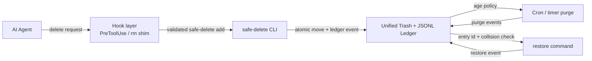

# CONTRACT FREEZE PROPOSAL — Phase 1: Safe-delete architecture contract

**Status:** Contract Freeze proposal only; pending review and `FREEZE ACK` by
`@Dylan5237` on [Issue #3](https://github.com/Dylan5237/safe-delete-cli/issues/3).

**Contract ID:** `safe-delete/p1` · proposed version `1`

**Review artifact:** [docs PR #10](https://github.com/Dylan5237/safe-delete-cli/pull/10)

This document is a reviewable mirror of the Contract Freeze proposal posted on
Issue #3. It defines behavior and interfaces for the later implementation and
evidence phases. It does not authorize product implementation before the
disposer records `FREEZE ACK`.

## Goal and boundaries

### Product goal

Provide one safe-delete protocol for AI-agent workspaces:

1. Agent deletion requests go through `safe-delete`, not raw `rm`.
2. Successful deletions move entries into one unified trash root.
3. Every move has an append-only ledger record with enough identity and context
   to list, restore, audit, and later purge it.
4. Restore returns an entry to its original path, subject to explicit collision
   safety.
5. A timed purge removes only eligible, already-trashed entries under an
   explicit retention policy.
6. A hook layer covers supported `PreToolUse` and `rm`-shim boundaries. It is a
   client-side control, not a kernel guarantee.

### Phase 1 goal

Freeze one behavior-focused contract so P2–P6 can implement and verify against
named boundaries without making architecture guesses. The contract fixes the
CLI vocabulary, storage identity, ledger compatibility rules, restore and purge
safety, hook failure behavior, and acceptance gates.

### In scope

- The CLI command surface and machine-readable output expectations.
- One configurable, unified trash root shared by projects for a user.
- An append-only UTF-8 JSONL ledger with versioned lifecycle events.
- P2 minimum fields and P3 rich metadata fields.
- Collision, path, atomicity, restore, and failure semantics.
- The adapter-neutral hook contract for supported agent/tool boundaries.
- Default purge retention, dry-run behavior, cron/timer invocation, and audit
  semantics.
- Replayable acceptance gates for P2, P3, P4, P5, and P6.

### Out of scope for this proposal

- Product CLI, hook packages, scheduler, or test-harness implementation.
- A graphical interface, web service, remote trash, or multi-user server.
- Copying across filesystems as a substitute for an atomic move.
- Automatic ledger compaction, cloud backup, encryption, or legal retention.
- Vendoring or depending on `skills-desktop` `trashService`; the design remains
  a thin CLI, ledger, and hook layer.
- Changes to the pinned `agent-project-ops` methodology.

### Deferred to later phases

- **P2:** CLI, atomic trash move, minimum ledger writer, and restore.
- **P3:** rich project/session/reason/agent/tool metadata and compatibility
  tests.
- **P4:** concrete PreToolUse adapters, `rm` shim, installation, and hook
  enforcement tests.
- **P5:** retention evaluator, periodic purge runner, and purge failure/retry
  tests.
- **P6:** clean-checkout full-path replay and evidence-to-acceptance matrix.

## Architecture



The CLI is the single supported deletion path. A hook may route a recognized
raw deletion request to `safe-delete add`, or deny it when routing is not safe.
Direct CLI calls are valid when the hook is not the caller. The hook never
reports success until the CLI reports success.

The default deployment is local and per-user:

```text
AI agent → configured hook boundary → safe-delete CLI
                                      ├─ move into unified trash
                                      └─ append/read JSONL ledger
                                                     ├─ restore
                                                     └─ cron/timer purge
```

## CLI contract

The executable is `safe-delete`. All commands accept the global options
`--root DIR` (or `SAFE_DELETE_ROOT`) and `--json` where output is meaningful.
Paths are passed after `--` when an option-like path must be unambiguous.

| Command | Contract and important flags |
| --- | --- |
| `safe-delete init` | Create the root, `trash/objects`, `locks`, and ledger if absent. `--root DIR`, `--json`. Never removes existing data. |
| `safe-delete add PATH...` | Move each existing regular file, directory, or symlink into trash and append one `trash` event per successful path. `--reason TEXT`, `--project DIR`, `--session-id ID`, `--agent ID`, `--tool ID`, `--dry-run`, `--root DIR`, `--json`. |
| `safe-delete list` | List active entries by default. `--all` includes restored, purge-pending, purged, and failed entries; `--project DIR`, `--original PATH`, `--json`, `--root DIR`. Malformed records are reported, never guessed. |
| `safe-delete show ENTRY_ID` | Show the immutable creation record and lifecycle events for an entry. `--json`, `--root DIR`. |
| `safe-delete restore ENTRY_ID` | Move an active payload to its original path. `--to PATH` is an explicit alternate destination; `--create-parents` opts into creating missing parents; `--json`, `--root DIR`. Existing destinations are never overwritten. |
| `safe-delete purge` | Preview eligible entries by default. `--dry-run` is explicit preview; physical deletion requires both `--execute` and `--yes`. Optional `--older-than DURATION` or `--before RFC3339` may narrow/override the configured threshold; `--json`, `--root DIR`. |
| `safe-delete hook install AGENT` | Reserved for P4 adapter packages. Installation is not part of the P1 or P2 implementation. |
| `safe-delete version` | Print the CLI and contract versions without touching trash or ledger state. |

### CLI behavior and errors

- `add` is a move operation, not a copy followed by an untracked delete. It
  refuses special files (devices, sockets, and FIFOs) and final-target
  symlink traversal; it moves a symlink itself.
- Each input to `add` is independently transactional. A batch may have partial
  success; `--json` reports one result per input and the process exits nonzero
  if any input fails.
- Successful commands emit stable JSON objects when `--json` is supplied and
  diagnostics to stderr. The CLI does not print a success response for a
  physically moved item until its ledger event is durable.
- The reserved exit categories are: `0` success, `2` usage/unsupported input,
  `3` destination or identity conflict, `4` storage/ledger failure, and `5`
  partial batch failure. Exact numeric mapping is implementation detail only
  if the named category and machine-readable error code remain stable.
- A source that does not exist, a root path, a path inside the trash root, an
  unsafe ancestor/descendant relationship with the trash root, or a
  cross-device move is rejected with the source left unchanged.
- No command has an implicit `--overwrite`, and no hook may add one.

## Storage layout and identity

The default root is:

```text
${SAFE_DELETE_ROOT:-${XDG_DATA_HOME:-$HOME/.local/share}/safe-delete}
```

An explicit `--root` takes precedence over the environment. The root is one
unified namespace for the current user; it is not a `.trash` directory per
project.

```text
<root>/
├── ledger.jsonl
├── locks/
│   └── ledger.lock
└── trash/
    └── objects/
        └── <entry_id>/
            └── payload
```

The root and its private subdirectories are created with user-only permissions
where the host supports them. `trashed_path` is the absolute path to
`<root>/trash/objects/<entry_id>/payload`.

### Identity and collision policy

- Every trash operation receives a cryptographically random UUID/ULID-like
  `entry_id`; the ID is the identity, not the original basename or project.
- The object directory is created with exclusive creation. An ID collision is
  retried; an existing object is never overwritten or reused.
- Multiple historical entries may have the same `original_path`. `list` must
  expose each distinct `entry_id`.
- Restore defaults to the recorded `original_path`. If that destination exists,
  restore fails with a collision and leaves the payload and ledger unchanged.
  The operator may choose a non-existing `--to PATH`; the effective destination
  is recorded in the restore event. Automatic renaming and overwrite are not
  part of this contract.
- Paths are stored as absolute, normalized paths. The final symlink is not
  dereferenced for `add`; existing parent symlinks are resolved consistently by
  the implementation before the move. The trash root, its ledger, and its lock
  files are never valid deletion targets.
- The default move must be an atomic same-filesystem rename. On `EXDEV` or any
  unavailable atomic primitive, the CLI fails closed and leaves the source in
  place; P1 does not authorize a copy/delete fallback.
- The ledger is serialized with the lock. An append is newline-delimited,
  UTF-8, and flushed durably before the CLI reports success. If a ledger append
  fails after a move, the CLI attempts to roll the payload back. If rollback
  also fails, it returns a storage error and prints both paths for manual
  recovery; it never falls back to raw deletion.

## Ledger contract

`<root>/ledger.jsonl` is an append-only event log: one UTF-8 JSON object per
line, no pretty-printing, and no in-place edits. An `entry_id` identifies one
payload; an `event_id` identifies one ledger event. The logical current state is
computed by replaying valid events for an entry in file order.

### Versioning and compatibility

- `schema_version` is the integer ledger schema major, currently `1`.
- Additive fields in schema `1` are allowed only as defined core fields or
  inside `extensions`; they do not change the version.
- A breaking change increments `schema_version`. A reader must not restore or
  purge an entry with an unsupported future version; it reports the entry as
  unsupported instead.
- P3 readers treat a missing P2 rich field as `null` and preserve unknown
  `extensions`. They must not rewrite old lines just to add fields.
- A malformed line, duplicate `event_id`, or impossible lifecycle transition
  is an audit error. `list` reports it; destructive commands fail closed rather
  than inferring state.

### Fields

| Field | P2 minimum | P3 rich contract | Meaning |
| --- | --- | --- | --- |
| `schema_version` | Required integer `1` | Required | Ledger schema major. |
| `event_id` | Required unique ID | Required | Unique event identity for replay/deduplication. |
| `entry_id` | Required unique ID | Required | Stable identity of the trashed payload. |
| `operation` | Required: `trash` or `restore` | Also `purge_intent`, `purge_complete`, `purge_failed` | Lifecycle event. |
| `state` | Required: `active` or `restored` | Also `purge_pending` or `purged` | Resulting logical state after the event. |
| `original_path` | Required on every event | Required | Absolute normalized source/destination path recorded at `add`. |
| `trashed_path` | Required on every event | Required | Absolute payload path under the unified root. |
| `kind` | Required: `file`, `directory`, or `symlink` | Required | Entry kind; special files are rejected. |
| `timestamp` | Required | Required | Event time in UTC RFC 3339 format with `Z`; the initial `trash` time is the retention age anchor. |
| `restore_path` | Required on `restore`, otherwise absent | Same | Actual restore destination, equal to `original_path` unless `--to` was used. |
| `project` | Absent or `null` | Present on all events, nullable | Canonical project root when known. |
| `session_id` | Absent or `null` | Present on all events, nullable | Agent session/invocation identity when supplied. |
| `reason` | Absent or `null` | Present on all events, nullable | Human/agent-provided deletion reason; never invented from a guess. |
| `agent` | Absent or `null` | Present on all events, nullable | Calling agent identity when known. |
| `tool` | Absent or `null` | Present on all events, nullable | Calling tool or hook adapter identity. |
| `extensions` | Optional object | Optional object | Namespaced additive metadata; unknown keys are preserved. |
| `error_code` | Absent | Required on `purge_failed` | Stable failure classification; payload remains available. |

The P2 creation record is therefore at least:

```json
{"schema_version":1,"event_id":"evt-…","entry_id":"ent-…","operation":"trash","state":"active","original_path":"/workspace/app/file.txt","trashed_path":"/home/user/.local/share/safe-delete/trash/objects/ent-…/payload","kind":"file","timestamp":"2026-09-16T07:00:00Z"}
```

A P3 creation record adds the reserved rich keys, including explicit `null`
values when context is unavailable:

```json
{"schema_version":1,"event_id":"evt-…","entry_id":"ent-…","operation":"trash","state":"active","original_path":"/workspace/app/file.txt","trashed_path":"/home/user/.local/share/safe-delete/trash/objects/ent-…/payload","kind":"file","timestamp":"2026-09-16T07:00:00Z","project":"/workspace/app","session_id":"sess-123","reason":"remove generated artifact","agent":"codex/luna","tool":"pretooluse:shell","extensions":{}}
```

`restore` appends a completed restore event only after the move succeeds;
`purge` uses a durable `purge_intent` before physical removal and then appends
`purge_complete`. A failed purge appends `purge_failed` while retaining the
payload, so retry is safe. Replaying the ledger must leave a purged payload
ineligible for restore and a restored payload ineligible for purge.

### P3 metadata source and missing-value policy

For each rich field, the source precedence is explicit CLI flag, hook-provided
context, supported environment context, then detected value where defined:

- `project`: `--project`, hook context, `SAFE_DELETE_PROJECT`, nearest detected
  project root from the invocation directory, otherwise `null`.
- `session_id`: `--session-id`, hook context, `SAFE_DELETE_SESSION_ID`, otherwise
  `null`; the CLI must not fabricate a stable session identity.
- `reason`: `--reason`, hook context, otherwise `null`.
- `agent`: `--agent`, hook context, `SAFE_DELETE_AGENT`, otherwise `null`.
- `tool`: `--tool`, hook context, otherwise `"safe-delete-cli"` for a direct
  CLI call or `null` when the caller cannot be identified.

`timestamp` is generated by the CLI in UTC. Caller-supplied timestamps are not
accepted as the audit timestamp.

## Restore semantics

`safe-delete restore ENTRY_ID` selects one active entry by stable ID, checks
that the payload exists and is a supported schema, checks the destination, and
moves the payload back. The default destination is `original_path`; `--to` is
an explicit alternative. It never overwrites, follows the deleted final
symlink, or silently restores a different entry.

Missing parent directories cause a safe failure by default. `--create-parents`
is the explicit opt-in and is covered by restore tests. A restored entry stays
in the ledger for audit and is not eligible for a later purge. Repeating the
same restore returns an idempotent `already_restored` result without changing
the filesystem.

## Hook contract

P4 will provide host-specific packages, but every adapter must normalize to the
following adapter-neutral request/decision contract:

```json
{
  "protocol_version": 1,
  "request_id": "req-123",
  "tool": "shell",
  "argv": ["rm", "-rf", "build"],
  "cwd": "/workspace/app",
  "project": "/workspace/app",
  "session_id": "sess-123",
  "agent": "codex/luna"
}
```

The hook returns one of:

```json
{"request_id":"req-123","decision":"route","reason_code":"raw_delete","safe_delete_argv":["safe-delete","add","--project","/workspace/app","--session-id","sess-123","--agent","codex/luna","--tool","pretooluse:shell","--","/workspace/app/build"]}
```

or:

```json
{"request_id":"req-123","decision":"deny","reason_code":"unsupported_delete_invocation","message":"Use safe-delete add with explicit paths."}
```

### What is intercepted

- A configured `PreToolUse` adapter intercepts supported shell/tool requests
  whose executable is `rm`, `unlink`, or `rmdir` (including supported
  `-r`/`-R`/`-f` forms and `--` path operands).
- An `rm` shim on `PATH` applies the same recognized-argv policy and invokes
  `safe-delete add` with hook metadata.
- `safe-delete add` itself is allowed and is never routed recursively.
- Unsupported flags, ambiguous tokenization, shell expansion that the adapter
  cannot prove safe, missing metadata required by the host, unavailable CLI,
  unwritable storage/ledger, or a nonzero CLI result all produce `deny` or a
  failed shim exit. Raw deletion is never the fallback.

### Known bypass limits

This is an honest client-side boundary. It does not intercept deletion through
Python/Go/Node filesystem APIs, `find -delete`, `git clean`, `busybox rm`, an
absolute `/bin/rm`, another unconfigured agent/tool, a container or namespace
without the hook, a privileged process, or a human process. A user can also
remove or bypass a shim. P4 must test and document these limits; it must not
claim universal enforcement. Only an OS policy/kernel control outside this
product could make that stronger, and that is a non-goal.

## Purge policy

- Default retention is **30 days** from the initial `trash` event’s UTC
  `timestamp`.
- `purge` defaults to dry-run and has no physical deletion side effect.
  Execution requires explicit `--execute --yes`; a non-interactive cron/timer
  invocation must include both.
- The recommended daily timer is equivalent to:

  ```cron
  0 2 * * * /usr/bin/safe-delete purge --execute --yes --json
  ```

  Installation and platform-specific service files are deferred to P5.
- Only active entries older than the threshold are candidates. Restored,
  purge-pending, purged, failed-schema, malformed, future-dated, and unknown
  entries are skipped and reported.
- `--older-than` or `--before` may explicitly select a different threshold;
  the default timer never overrides 30 days. A threshold shorter than the
  configured default requires explicit operator flags and is visible in the
  dry-run output.
- Purge holds the ledger lock, processes entries independently, and continues
  after a per-entry failure. It returns a partial-failure result if any entry
  was not processed; failed entries retain their payload.
- Purge removes payload data only after a durable `purge_intent` event and
  records `purge_complete` only after removal. The ledger history is retained;
  ledger compaction is deferred and cannot erase the audit trail implicitly.
- Clock skew, malformed timestamps, and unknown schema versions fail closed for
  eligibility. Purge never guesses an age.

## Later-phase acceptance gates

These are proposed, replayable gates. They are not verification results and do
not grant Phase Accept.

| Phase | Acceptance gate |
| --- | --- |
| P2 — CLI + ledger + restore | In a clean test root, `add` moves a file and directory without leaving the source, emits stable IDs, and appends valid P2 records. `list` finds them. `restore` returns each to the original path, refuses an occupied destination without changing either side, and preserves the ledger history. Injected ledger/storage failure leaves no silent raw delete. |
| P3 — rich metadata | A deletion supplied with project, session, reason, agent, and tool context persists exact values, uses `null` when unavailable, and preserves arbitrary `extensions`. A P3 reader lists and restores P2 records with omitted rich fields without rewriting them. |
| P4 — hook enforcement | Supported PreToolUse and shim forms route to `safe-delete add`; the original raw command never executes. Unsupported/ambiguous forms, unavailable CLI, unwritable root, and CLI failure deny. Safe-delete calls pass once. The bypass inventory above is exercised and reported as out of coverage. |
| P5 — timed purge | A default dry-run selects only active entries at least 30 days old. `--execute --yes` removes eligible payloads, appends auditable intent/completion events, is retry-safe, leaves young/restored/unknown/failing entries intact, and reports partial failure. The documented daily timer invokes the same explicit command. |
| P6 — full-path evidence | From a clean checkout, replay an agent deletion through hook → CLI → unified trash/ledger → list → restore and then a controlled aged-entry purge. Evidence records commit SHA, cwd, exact commands, tool/agent/session context, UTC timestamps, outputs, and artifact paths. The proof maps one-to-one to these gates and contains no product implementation change in an evidence PR. |

P1 itself is complete only when the disposer confirms that one contract is
reviewable, the proposed schema/CLI and later gates are unambiguous, and
`@Dylan5237` posts `FREEZE ACK` on Issue #3. No `feat/` or `fix/` branch is
authorized before that comment.

## Explicit non-goals

- This is **not** an OS-wide mandatory kernel or filesystem deletion policy.
- This is **not** a replacement for OS Trash/Recycle Bin behavior for humans.
- This is not a promise that every process, language runtime, container, or
  privileged actor is intercepted.
- This is not a license to silently overwrite a restore destination or purge
  before the retention policy permits it.

## P2–P6 atomic commit plan and alignment

The existing [`docs/project/commit-plan.md`](https://github.com/Dylan5237/safe-delete-cli/blob/main/docs/project/commit-plan.md) on
`main` remains the project’s proposed atomic plan and is subordinate to this
Phase contract and disposer decisions. The list below **preserves every
P2–P6 commit slice already named there** and refines it by mapping each slice
to this document; it is not a competing product plan. Any accepted wording
change to the shared plan will be a later docs commit after `FREEZE ACK`.

### P2 — CLI + minimum ledger + restore (Issue #4)

1. `feat: add unified trash move primitive` — §§ CLI behavior, Storage layout,
   identity/collision, and same-filesystem failure semantics.
2. `feat: add minimum ledger writer` — §§ Ledger versioning, P2 fields, and
   durable JSONL append rules.
3. `feat: add restore command` — § Restore semantics and collision behavior.
4. `test: cover cli ledger and restore contract` — P2 acceptance gate above;
   proof artifacts remain separate from implementation.

### P3 — Rich metadata (Issue #5)

1. `feat: add rich deletion metadata schema` — §§ P3 fields, versioning, and
   extensions.
2. `feat: record project session reason agent and timestamp` — § P3 metadata
   source and missing-value policy.
3. `test: preserve legacy ledger restore compatibility` — version and
   compatibility rules plus the P3 acceptance gate.

### P4 — Hook enforcement (Issue #6)

1. `feat: add safe-delete hook boundary` — § adapter-neutral Hook contract and
   supported invocation set.
2. `feat: reject raw deletion attempts` — § fail-closed decisions and bypass
   limits.
3. `test: cover hook enforcement paths` — P4 acceptance gate, including
   unsupported and unavailable-CLI cases.

### P5 — Timed purge (Issue #7)

1. `feat: add retention eligibility policy` — § Purge policy defaults,
   threshold, clock, and state rules.
2. `feat: add periodic purge runner` — § timer invocation, lock, retry, and
   audit-event semantics.
3. `test: cover purge dry-run and partial failure` — P5 acceptance gate.

### P6 — Full-path evidence (Issue #8)

1. `test: add full-path replay harness` — P6 clean-checkout replay gate.
2. `docs: publish acceptance-to-proof matrix` — gate-to-proof mapping and
   exact invocation record.
3. `evidence: capture full-path verification` — proof-only branch/PR labeled
   `pr:evidence`; no feature, fix, or product implementation diff.

All topic branches remain origin-only and use the repository’s
`{type}/{issue}-{slug}` convention. Merge is not Phase PASS; only the named
disposer may record `PHASE ACCEPT`.

## Review request

This is a proposal, not a self-freeze. Disposer `@Dylan5237`, please review
Issue #3 and this document and reply with exactly:

- `FREEZE ACK` if the contract is ready for implementation phases; or
- `FREEZE RETURN` followed by the required deltas if it is not.
